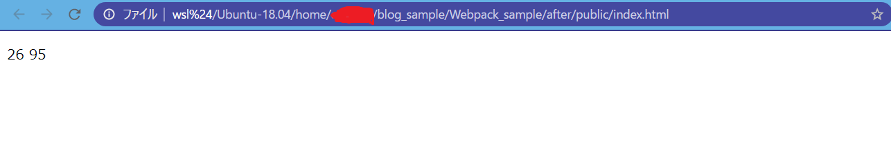

# バンドルする

いよいよ JavaScript ファイルのバンドルを行います。

## npm scripts について

今回のバンドル作業では`npm scripts`というものが使用します。

作成した`package.json`には`"scripts"`を記入しています。

```json
<!-- package.json -->

### 一部省略
  "scripts": {
    "build": "webpack"
  }
}

```

これにより`npm run build`とコマンドで入力することで実際にバンドルを行ってくれる`webpack`コマンドを代わりに入力してくれます。
`webpack`コマンドを直接入力しても問題ないですが、明文化的な意味で`package.json`に記載してしまったほうがいいです。

## バンドルしたものが実際に動作するのか確認

```bash
npm run build
```

バンドル作業が実行されて、正常に動作すればコマンドに以下のような表示がされているはずです。

```bash
> after@1.0.0 build /home/eriyoshi/blog_sample/Webpack_sample/after
> webpack

Hash: 96f1c1c3120c5dbf936c
Version: webpack 4.43.0
Time: 57ms
Built at: 06/26/2020 11:12:29 AM
    Asset      Size  Chunks             Chunk Names
bundle.js  5.56 KiB    main  [emitted]  main
Entrypoint main = bundle.js
[./src/js/app.js] 212 bytes {main} [built]
[./src/js/modules/celsius.js] 61 bytes {main} [built]
[./src/js/modules/fahrenheit.js] 79 bytes {main} [built]
```

今回のサンプルだと、エントリーポイントに`/src/js/app.js`とモジュールを export した`celsius.js`と`fahrenheit.js`がバンドル対象となります。

出力先に設定した`public/js/bundle.js`にはバンドルされた後の長いコードが出力されています

```js
/******/ (function(modules) { // webpackBootstrap
/******/ 	// The module cache
/******/ 	var installedModules = {};
/******/
/******/ 	// The require function
/******/ 	function __webpack_require__(moduleId) {
/******/
/******/ 		// Check if module is in cache
/******/ 		if(installedModules[moduleId]) {
/******/ 			return installedModules[moduleId].exports;
## 長いため省略
```

バンドルが終わったので`index.html`を開いてみます。
値が出力されているはずです。



お疲れ様でした。
